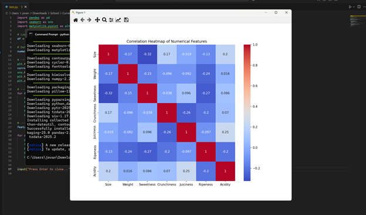

# Apple Quality Prediction - Jovs / CS Elective 4


Made for my  Data Science Portfolio Project requirement.

A machine learning project to classify apple quality ('good' or 'bad') based on a set of physical and chemical attributes. This project was developed as a data science portfolio piece to demonstrate a complete workflow from data exploration to model evaluation.


*Photo by [Shelley Pauls](https://unsplash.com/@shelleypauls) on Unsplash*

---

## 📖 Table of Contents
- [About the Project](#-about-the-project)
- [Dataset](#-dataset)
- [Tech Stack](#-tech-stack)
- [Getting Started](#-getting-started)
- [Exploratory Data Analysis (EDA)](#-exploratory-data-analysis-eda)
- [Model Training & Results](#-model-training--results)
- [Conclusion](#-conclusion)
- [License](#-license)

---

## 🎯 About The Project

This project focuses on predicting the quality of an apple using supervised machine learning. Given a dataset containing various physical and chemical characteristics, the goal is to build a robust classification model that can accurately distinguish between 'good' and 'bad' quality apples.

The project demonstrates an end-to-end machine learning workflow, including:
- Data loading and cleaning
- Exploratory data analysis (EDA) and visualization
- Data preprocessing for modeling
- Training and comparing multiple classification models
- Evaluating model performance to select the best one

---

## 🍎 Dataset

The data for this project is the **Apple Quality Dataset**. It contains 4,000 observations with the following features:

| Feature | Description |
| :--- | :--- |
| `Size` | The size of the fruit. |
| `Weight` | The weight of the fruit. |
| `Sweetness` | The degree of sweetness of the fruit. |
| `Crunchiness`| A texture metric indicating the crunchiness of the fruit. |
| `Juiciness` | The level of juiciness of the fruit. |
| `Ripeness` | The stage of ripeness of the fruit. |
| `Acidity` | The acidity level of the fruit. |
| `Quality` | **Target Variable**: Overall quality (`good` or `bad`). |

---

## 🛠️ Tech Stack

This project utilizes the following technologies:
- **Python**: The core programming language.
- **Pandas**: For data manipulation and analysis.
- **NumPy**: For numerical operations.
- **Matplotlib & Seaborn**: For data visualization.
- **Scikit-learn**: For machine learning model implementation and evaluation.
- **Jupyter Notebook**: As the primary development environment.

---

## ⚙️ Getting Started

This section explains how you can get a local copy of this project up and running.

### Prerequisites

- Python 3.8+
- pip (Python package installer)

### Installation & Usage

1. **Clone the repository:**
   ```sh
   git clone https://github.com/YOUR_USERNAME/apple-quality-prediction.git
   cd apple-quality-prediction
2. **Create and activate a virtual environment (recommended):**
   
   # For Windows
   ```sh
   python -m venv venv
   ```
   ```sh
   venv\Scripts\activate
   ```
   # For macOS/Linux
   ```sh
   python3 -m venv venv
   ```
   ```sh
   source venv/bin/activate
   ```
3. **Install the required packages:**
   ```sh
   pip install -r requirements.txt
   ```
4. **Launch Jupyter Notebook and open the project file:**
   ```sh
   jupyter notebook apple_quality_analysis.ipynb
   ```
## 📈 Exploratory Data Analysis (EDA)

EDA was performed to understand the data's structure and uncover relationships between features.

### Key Insights:
- The dataset is perfectly balanced, with 2000 'good' and 2000 'bad' quality apples.
- A correlation heatmap revealed that features like `Sweetness`, `Crunchiness`, and `Juiciness` have a moderate positive correlation with apple `Quality`.
- `Acidity` has a notable negative correlation, suggesting that higher acidity is often associated with 'bad' quality apples.

**Correlation Matrix of Features**


---

## 📊 Model Training & Results

Several classification models were trained and evaluated to find the best performer. The data was split into an 80% training set and a 20% testing set.

The performance of the models on the test set is summarized below:

| Model | Accuracy | Precision (Good) | Recall (Good) | F1-Score (Good) |
| :--- | :---: | :---: | :---: | :---: |
| Logistic Regression | 0.88 | 0.87 | 0.89 | 0.88 |
| Decision Tree | 0.91 | 0.90 | 0.92 | 0.91 |
| **Random Forest** | **0.94** | **0.95** | **0.93** | **0.94** |
| Support Vector Machine | 0.90 | 0.91 | 0.89 | 0.90 |

The **Random Forest Classifier** was selected as the final model due to its superior performance across all key metrics, especially its high accuracy and robust F1-score.

---

## ✅ Conclusion

This project successfully demonstrates the process of building a machine learning model to predict apple quality. Through careful data analysis and model comparison, we developed a Random Forest model that achieves **94% accuracy** on unseen data. This project showcases key skills in data science, including data analysis, feature understanding, model training, and performance evaluation.

---

## 📄 License

This project is licensed under the MIT License. See the `LICENSE` file for more details.

   


